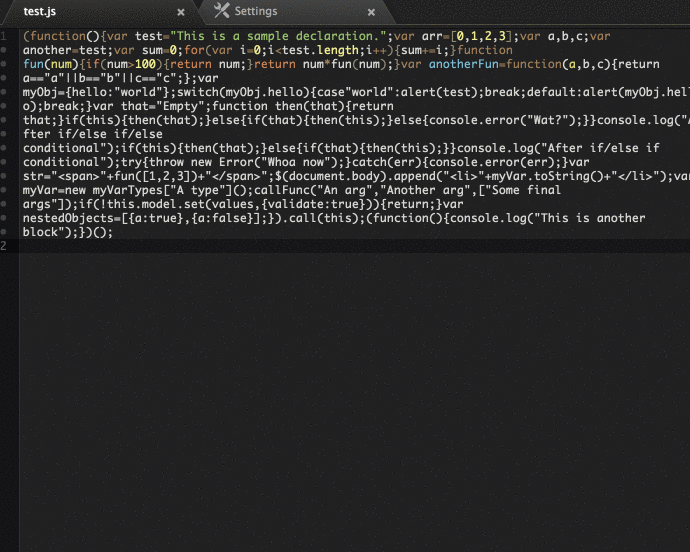

atom-jsfmt
==========

`atom-jsfmt` is a [`jsfmt`][jsfmt] plugin for the Atom text editor. It's pretty nifty.  




Features
--------
 - **Format command**: Run the `Jsfmt: Format` command to keep your code tidy.
 - **Format on Save**: `atom-jsfmt` will auto-format your javascript on save.


Installation
------------
Installation can be done from Atom's package browser (just search for `atom-jsfmt`). Or, if you like it the hard way:

```bash
apm install atom-jsfmt
```


Options
-------

 - **Show Errors**: Whether or not you want to see error messages. You probably do.
   This is set to `true` by default.
 - **Format On Save**: Whether or not you automatically want to format your javascript
   files when you save. Defaults to `true`.


To do
-----

 - Allow for input of custom rules
 - Add searching functionality
 - Flag lines with errors


Credit
------

 - [`jsfmt`][jsfmt] is written and maintained by the good folks at [rdio][rdio].


Changelog
---------
The changelog can be viewed [here][changelog].


License
-------
Atom-jsfmt is licensed under the MIT license, which can be viewed [here][license].


[jsfmt]:http://rdio.github.io/jsfmt/
[rdio]:https://github.com/rdio
[changelog]:./CHANGELOG.md
[license]:./LICENSE.md
[env]:http://discuss.atom.io/t/atom-command-doesnt-pass-environment-variables-to-atom/1596
